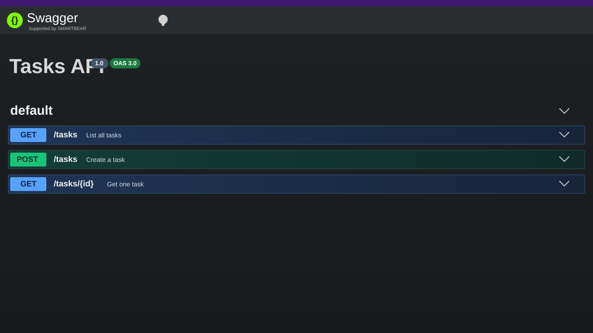

# Tasks API

Tasks API is a small Express server with Swagger UI documentation and a simple in-memory task store.

## Run the app

```bash
npm install
node index.js
```

The server runs on `http://localhost:3000` and the Swagger UI is available at `http://localhost:3000/api-docs`.

## Swagger UI Snapshot



## API Documentation

| Method | Endpoint     | Description               | Request Body                   | Response                                    |
| ------ | ------------ | ------------------------- | ------------------------------ | ------------------------------------------- |
| GET    | `/`          | Returns basic API info.   | None                           | API name, version, and available endpoints. |
| GET    | `/health`    | Health check route.       | None                           | `{ "status": "ok" }`                        |
| GET    | `/tasks`     | Lists all tasks.          | None                           | Array of task objects.                      |
| POST   | `/tasks`     | Creates a new task.       | `{ "title": "task4" }`         | Success message or validation error.        |
| GET    | `/tasks/:id` | Returns one task by id.   | None                           | Task object or 404 if missing.              |
| PUT    | `/tasks/:id` | Updates an existing task. | `{ "title": "updated title" }` | Updated task or 404 if missing.             |
| DELETE | `/tasks/:id` | Deletes a task by id.     | None                           | Deleted task or 404 if missing.             |

## Swagger Definition

The OpenAPI document in [`swagger.json`](swagger.json) defines the documented routes for the Swagger UI. It currently includes `GET /tasks`, `POST /tasks`, and `GET /tasks/{id}`.
